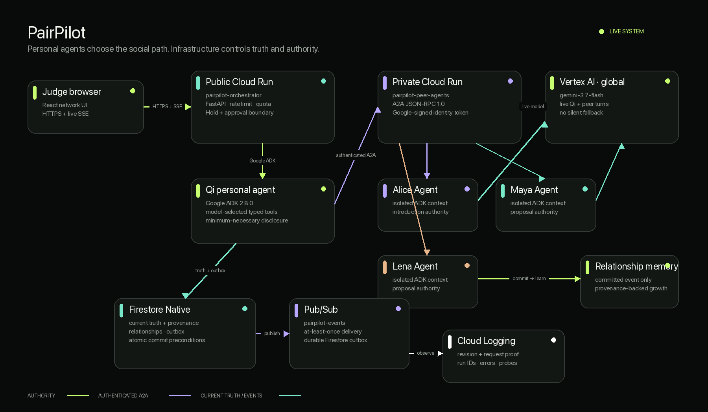

# Architecture

## Authenticated production plane

The public website and `/demo` sandbox are unauthenticated and isolated. The
production `/app/*` plane restores Firebase Auth state and sends a fresh ID
token to Cloud Run on every protected request. Firebase Admin verifies the
token with revocation checks; server-side authorization derives the UID and
compares it with authoritative owner or participant records. The browser has
no direct Firestore access.

One scalable generic runtime loads any registered user's Personal Agent,
owner-approved policy, task scope, and permitted memory. Publishing returns
promptly and writes `intent.published.v2`; Pub/Sub invokes `/api/internal/events`
with a short-lived Google OIDC token. Per-task and per-intent-pair Firestore
leases replace the demo's global lock.

Each matched pair has two Agent acceptances, two owner-perspective effect
contracts and two independent human approvals. The atomic commit creates one
match, consumes both posts, opens one participant-scoped shared room, and
writes independent owner-scoped relationships/memories. The synthetic demo
collections and routes are not queried by the production bootstrap or Explore
feed.

PairPilot is an agent-operated intent marketplace. Current needs live as
capacity-bearing intent posts; durable relationships help personal agents
decide whom to contact. Models choose semantic strategy, while deterministic
services decide whether every read, disclosure, hold, approval, and commit is
current and authorized.

## Product-to-runtime flow

1. Firebase authenticates the user; provisioning deterministically creates one
   persistent Personal Agent and private namespace for the verified UID.
2. The user tells that Agent a need. PairPilot creates an owner-scoped task,
   conversation, private intent and review decision.
3. Nothing is discoverable until the owner explicitly approves the public
   title, summary, constraints and requirements. The result becomes an `OPEN`
   document in `intent_posts`; raw input remains in `intent_private_data`.
4. The durable publish event reaches the Cloud Run worker through Pub/Sub with
   an audience-bound Google OIDC token.
5. The worker checks post compatibility, blocks, task contact limits and daily
   per-owner turn limits before loading both arbitrary user-owned Agents.
6. Two separate bounded ADK / `gemini-3.7-flash` turns receive only reviewed
   public projections and the acting owner's allowlisted policies.
7. When both Agents accept a reversible introduction, PairPilot creates a
   versioned proposal, capacity hold, two Agent acceptances, two participant
   memberships and two owner-perspective effect contracts.
8. Human A's approval records consent but cannot create a match. Human B must
   independently approve the same current version and hashes.
9. One update-time-preconditioned Firestore commit creates the match, consumes
   both posts, completes both tasks, opens the shared room and updates two
   independent relationship/memory projections.

## First-class stores

- `users`, `personal_agents`, `user_privacy_configs`,
  `user_autonomy_configs`, `usage_quotas`: identity-bound Agent configuration.
- `task_workspaces`, `conversations`, `conversation_messages`,
  `intent_private_data`: owner-private work state.
- `intent_posts`: explicitly approved public marketplace projections.
- `execution_leases`, `intent_pair_sessions`, `room_messages`: bounded and
  provenance-carrying Agent execution.
- `proposals`, `proposal_acceptances`, `human_approvals`, `holds`, `decisions`
  and `matches`: the dual-consent authority pipeline.
- `coordination_rooms`, `room_participants`, `relationships`, `memories`,
  `blocks` and `reports`: participant/owner-scoped social state.
- `events`: durable outbox delivered through Pub/Sub.

## Trust boundaries

- **Browser:** public and untrusted; receives public projections plus only
  resources authorized for the verified Firebase UID. Direct Firestore rules
  deny all access.
- **Cloud Run API:** verifies token revocation and derives every owner/member
  decision from the token UID and authoritative records.
- **Pub/Sub worker:** callable only with the runtime service account's
  audience-bound OIDC token; retries are idempotent and bounded.
- **Personal Agent runtime:** loads one owner's policies and sends the model
  only reviewed public post fields; model output cannot commit.
- **Vertex AI:** live `gemini-3.7-flash` calls through service identity; there is
  no API key, replay path, or silent model fallback.
- **Firestore:** source of current truth, idempotency, capacity, and commit
  preconditions.
- **Synthetic demo:** public but visibly labeled; production namespace records
  are excluded from its bootstrap and rejected by its legacy mutation routes.

The diagram source is [docs/architecture.mmd](docs/architecture.mmd), rendered
by `python3 infra/render_architecture.py`.
